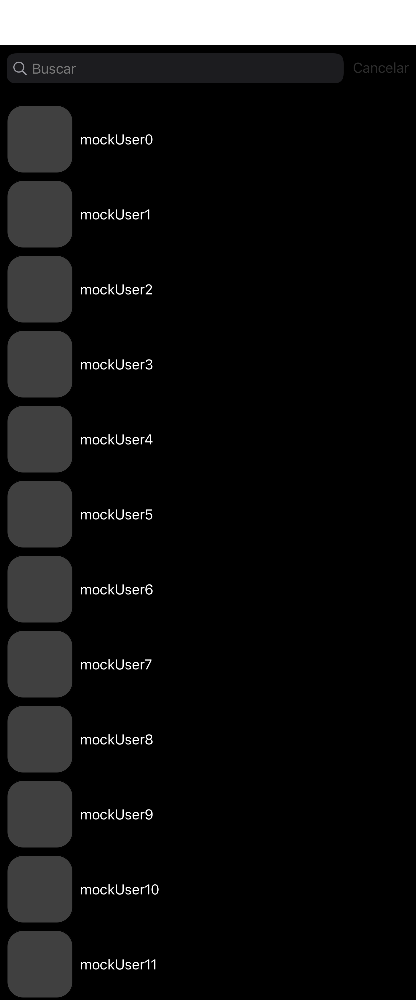
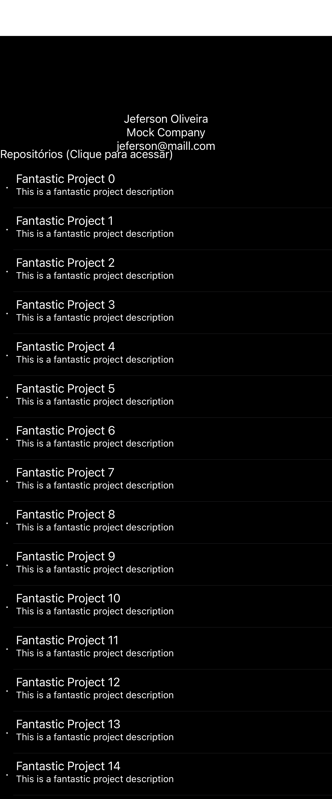

# Projeto para consumo da API de usuários do GitHub

1. Organizando as pastas dos arquivos 
2. Implementado o padrão MVVM-C 
3. Adicionada internacionalização com Localizable.strings 
4. Adicionando tratativa de loading e erro utilizando viewState
5. Implementando testes unitários em todas as camadas 
6. Implementando testes de Snapshot utilizando [Nimple-Snapshots](https://github.com/ashfurrow/Nimble-Snapshots)

    Testes com diversas dimensões de telas

    

    

    > [!IMPORTANT]
    > Para executar todos os testes, utilize o iPhone 14 Pro, pois os snapshots foram gravados utilizando ele :-)

## Requisitos para executar o projeto 

. Cocoapods 1.12.1
. Xcode 14.3+

